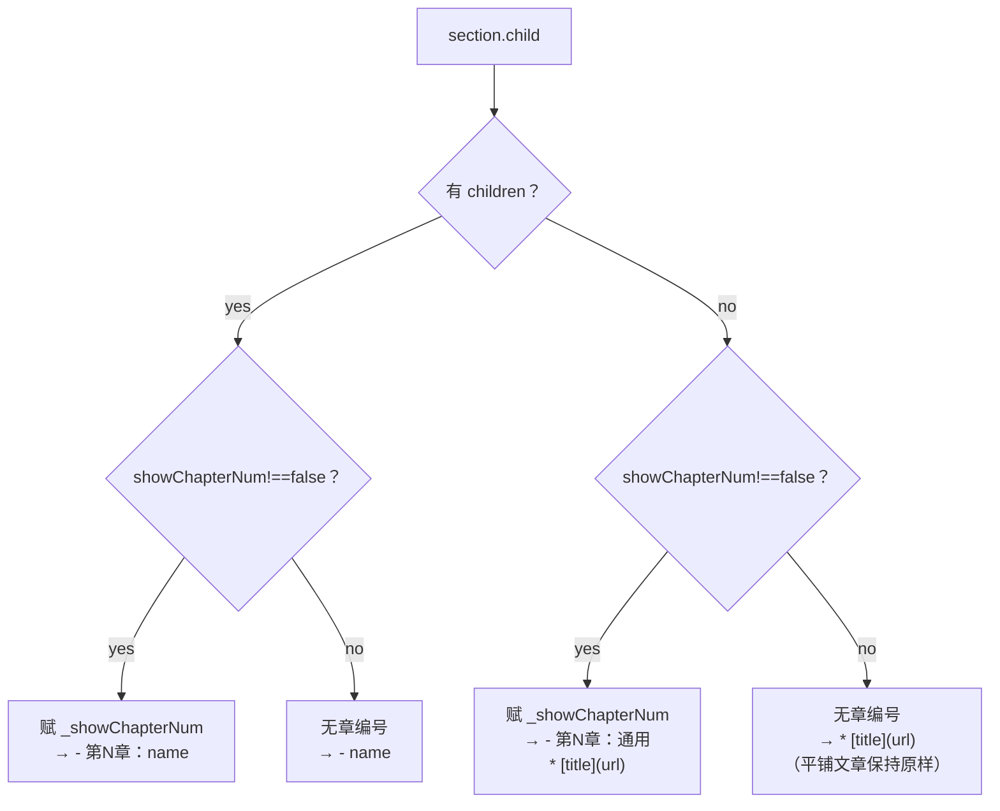
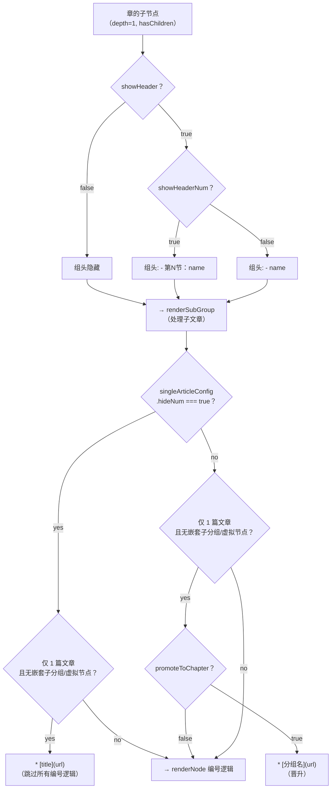
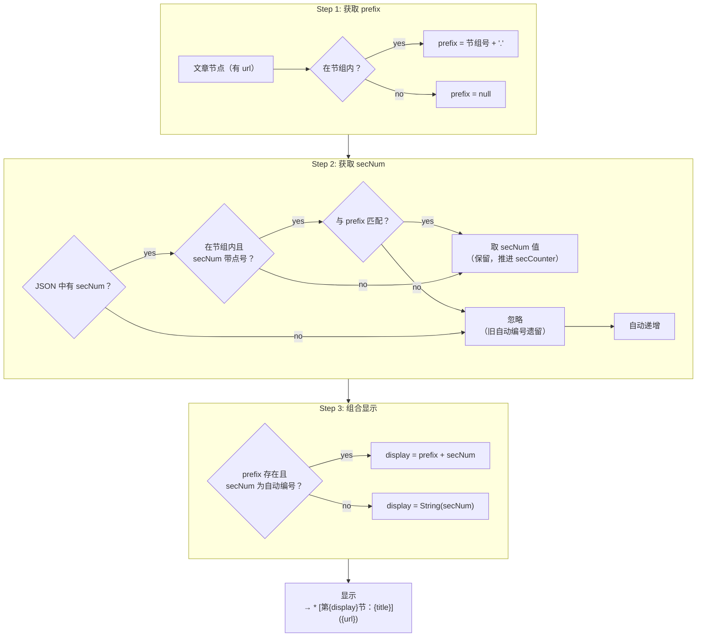

# 总目录_PRD

## 架构总览

```
总目录.md  ──→  parse-catalog.js  ──→  catalog.json
                    ↑                       │
              文件系统扫描              json-to-md.js
                                           │
                                           ↓
                                      总目录.md (覆盖)

总目录.html ──→  catalog_with_ratings.json (二阶段加载: fetch → file picker)
                                ↑
                         catalog_merge_ratings.sh
                                ↑
                      catalog.json + rating_*.json
```

## 核心原则：提取数据和重显数据的大原则

| 物理层级 | 代表 | 符号        | 显示为    | 层级定义  | 配置         | 示例                        |
| -------- | ---- | ----------- | --------- | --------- | ------------ | --------------------------- |
| 第1层    | 分类 | c(category) | c分类     | c         | -            | Architecture                |
| 第2层    | 分区 | s(section)  | s分区     | c.s       | depth2Config | 第二章：框架相关            |
| 第3层    | 祖节 | x           | 第x节     | c.s.x     | depth3Config | 第6节：H5与APP的交          |
| 第4层    | 父节 | y           | 第x.y节   | c.s.x.y   | 继承第3层    | 第6.1节：H5与原生交互：h5js |
| 第5层    | 子节 | z           | 第x.y.z节 | c.s.x.y.z | 继承第3层    | 第1.6.1节：OC+Swift混编问题 |

**具体示例1：Architecture**

第1层：Architecture (分类)
  └── 第2层：第二章：框架相关 (分区)
        └── 第3层：第6节：H5与APP的交 (祖节)
              └── 第4层：第6.1节：h5js (父节)
                    └── (暂无第5层示例)

**具体示例2：iOS**

第1层：iOS (分类)
  └── 第2层：第一章：基础 (分区)
        └── 第3层：第1节：语言 (祖节)
              └── 第4层：第1.6节：Swift (父节)
                    └── 第5层：第1.6.1节：OC+Swift混编问题 (子节)

**其他提取定制或者重显数据的定制都是在这大原则基础上，当触发了某个定制的前提时候进行的定制**

## 文件职责

| 文件 | 路径 | 职责 |
|------|------|------|
| `总目录.md` | `source/_posts/总目录.md` | 博客文章总目录源文件，同时也是排序来源 |
| `总目录.html` | `source/_posts/总目录/总目录.html` | HTML 渲染页面，二阶段加载 `catalog_with_ratings.json` |
| `parse-catalog.js` | `source/_posts/总目录/parse-catalog.js` | 扫描文件系统+总目录.md → catalog.json |
| `json-to-md.js` | `source/_posts/总目录/json-to-md.js` | catalog.json → 总目录.md（覆盖）|
| `catalog.json` | `source/_posts/总目录/data/catalog.json` | 结构化目录数据（无评分） |
| `catalog_with_ratings.json` | `source/_posts/总目录/data/catalog_with_ratings.json` | 含评分数据的目录（HTML 实际加载源）|
| `catalog_merge_ratings.sh` | `source/_posts/总目录/catalog_merge_ratings.sh` | 将 `rating_*.json` 合并到 catalog.json |

## catalog.json 数据契约

parse-catalog.js 的输出，json-to-md.js 的输入。根结构：

```json
{ "catalog": [ /* 分类（section）数组 */ ] }
```

### 分类（section）

| 字段 | 说明 |
|------|------|
| `type` | 分类名，如 `"iOS"`、`"Architecture架构"` |
| `rating_version` | 可选，评分版本号，如 `"0.1.0"` |
| `rating_rated_at` | 可选，评分日期，如 `"2026-05-26"` |
| `rating_standard` | 可选，评分标准名称 |
| `rating_standard_version` | 可选，评分标准版本 |
| `children` | 子节点（章/文章）数组 |
| `hidden` | 可选，`true` 时 HTML 渲染跳过 |

### 文章节点（有 `url`、无 `children`）

| 字段 | 说明 |
|------|------|
| `title` | 文章标题（frontmatter title） |
| `url`  | 相对路径，如 `"iOS/组件化/CocoaPods"` |
| `secNum` | 可选，如 `"1"`、`"3.2"`，从总目录.md 链接文本提取 |
| `date` | 原始发布日期 |
| `updated` | 最后更新日期 |
| `categories` | 数组 |
| `tags` | 数组 |
| `hideFromWeb` | 可选布尔值，`true` 时 HTML 渲染跳过该文章 |

| `rating` | 可选，总分，如 `73.5`，来自评分系统 |
| `scores` | 可选，各维度分 `{depth, practical, completeness, originality, timeliness, code_quality}` |

- 不含 `type` 字段
- key 顺序：`title` → `url` → `secNum` → `date` → `updated` → `categories` → `tags` → `hideFromWeb` → `rating` → `scores`
- `_pos`（排序用）在输出前清除

### 排序规则

- 数组元素（分类/章/文章）按 `_pos` 升序排列，`_pos` 来自 `总目录.md` 中链接的出现顺序
- 无 `_pos` 的虚拟节点插入到所属父节点的最后
- 排序在 `promoteToVirtualSections` 后进行，确保虚拟分类插入到正确位置

### 分组节点（有 `children`、无 `url`）

保留 `type` 字段（目录名，树构建的唯一标识），可选含 `virtual: true`。

### 示例

```json
{
  "catalog": [
    {
      "type": "iOS",
      "children": [
        { "type": "组件化", "children": [
          { "title": "CocoaPods", "url": "iOS/组件化/CocoaPods", "secNum": "1", "date": "..." }
        ]},
        { "title": "Swift 入门", "url": "iOS/Swift入门", "secNum": "2", "date": "..." }
      ]
    }
  ]
}
```

---

## 数据与构建：parse-catalog.js

### 配置

`_config.yml`:
```yaml
post_asset_folder: true
skip_render:
  - '_posts/总目录/**/*.{json,js,css,html}'
```

### 数据来源
- `source/_posts/` 下所有 `.md` 文件（不含 `SKIP_FILES`）
- `总目录.md` 中的链接（提取 `第X节` 编号和排序）

### 树构建
- 按**目录路径**构建层级树，而非 frontmatter `categories`
- `source/_posts/` 根目录下的文件不纳入目录树（不属于任何分类）

### 深度层级（数据模型定义）

```
分类（section）    → catalog 根节点
  ├── 章（chapter）      → section 的子节点，有 children，depth 1
  ├── 节组（group）      → chapter 的子节点，有 children，depth 2
  └── 文章（article）    → 叶子节点，有 url
```

- **平铺文章升级为章**：无 children 但有 `_showChapterNum` 的叶子节点
- **README 文章**：URL 以 `/README`、`_README` 或 ` README` 结尾
- 虚拟节点复用同一深度层级

### secNum 提取
- 从 `总目录.md` 链接文本正则 `/第((?:\d+\.)*\d+)节/` 提取
- 无 secNum 的文章在渲染时自动递增编号

### hideFromWeb 标记读取
- 检测 `总目录.md` 链接行右侧是否包含 `🙈` 字符
- 若包含，`assignPositions` 时将 `hideFromWeb: true` 写入节点
- 双来源：文章 frontmatter（parse-catalog.js 常规解析）+ 总目录.md `🙈` 标记（手动编辑便利）
- 前端 frontmatter 读取在 generic‑fm 循环中独立处理，不经过 `🙈` 检测路径
- `🙈` 在 总目录.md 输出中保留，供后续编辑时手动调整

### README 自动提升
- 子分组（depth ≥1）有 README child 时：README 的 title+url 提升为分组标题链接
- README 不单独作为文章渲染
- 平铺 README 文章（section 的直接 child）：不参与章编号和 secNum 自动编号，保持原样 `* [{title}]({url})`

### 虚拟分类

`VIRTUAL_SECTIONS` 配置，将子分组（及其文章）提升为顶级分类：
```js
const VIRTUAL_SECTIONS = [
  { type: '腾讯云', children: ['腾讯云cos1上传'] },
];
```

- `promoteToVirtualSections` 通过 `findNodeInCatalog` 匹配成员（支持按 `url` 匹配文章和按 `type` 匹配子分组），从原分类树递归移除，创建新分类节点 `{ type, virtual: true, children: [...], _pos: minChildPos }` 加入 catalog
- 处理时机在 `assignPositions` 之后、`sortByMdPosition` 之前，按 `_pos` 自动排序到正确位置
- 成员通过 `findNodeInCatalog` 匹配（无需 `category` 字段）
- 渲染时与普通分类完全一致（`## {type}` + `renderChildren`），无需修改渲染逻辑

### 虚拟章

`VIRTUAL_CHAPTERS` 配置，将同 section 下多个兄弟文章归为一个虚拟章：
```js
const VIRTUAL_CHAPTERS = [
  { type: 'AIGC', children: ['AIGC', 'ComfyUI入门'] },
  { type: 'AI Agent', children: ['AI-①Agent & SKILL', 'AI-②Open Design', 'AI-③opencode会话管理'] },
  { type: 'AI Tool', children: ['AI Tool-①cc-switch', 'AI Tool-②cc-connect', 'AI Tool-③cc-notify'] },
];
```

- 调用 `applyVirtualNodeGrouping(catalog, VIRTUAL_CHAPTERS)`，创建 `{ type, virtual: true, children: [...] }`
- 无需 `category` 字段，自动通过 `findCommonParent` 定位所属 section
- 渲染时使用中文数字编号（与真实 chapter 连贯），子文章保留各自 `secNum`
- 用户显式配置的成员列表即最终名单，仅成员全未找到（空数组）时才跳过

### 虚拟节

`VIRTUAL_GROUPS` 配置，将同章下多个平铺文章归为一个子分组：
```js
const VIRTUAL_GROUPS = [
  { type: '科学上网', children: ['科学上网_ClashX', '科学上网_SMS', ...] },
  { type: '通用', children: ['自动化分支信息'] },
];
```

- 调用 `applyVirtualNodeGrouping(catalog, VIRTUAL_GROUPS)`，创建 `{ type, virtual: true, children: [...] }`
- 通过 `findNodeInCatalog` 按 `url` 匹配成员，自动定位所属 section，替换原 children 中零散文章为虚拟组
- 单成员虚拟组也生效（成员列表为空时才跳过）

### 虚拟节溶解规则

- 当虚拟节位于**章**（有章编号的 section 子节点）下，且该章下无真实子分组（仅有虚拟节和文章）时：
  - 虚拟节自动溶解，子文章提升到章层级
  - 溶解时清理 secNum 中的分组前缀（如 `1.3` → `3`）
- 无章编号的 section 下的虚拟节不受影响（如 常识类/技术常识/科学上网）
- 溶解在 `dissolveChapterVirtualGroups` 中由 `NO_CHAPTER_SECTIONS` 和 depth 共同控制

---

## 渲染与编号：json-to-md.js

### 深度层级与缩进逻辑

#### 缩进层级

**默认**（无 depth2Config，renderSubGroup 回退）：
```
- 父分组（depth=1）
  - 子分组（depth=2）
    * [文章]（depth=3）
```

**depth2Config**（第 x 节有分组时，用来处理 x.y 节）：

```
// ① showHeader=true, flatSub=true
  - 第2节：                 ← 显示 header
  * [第2.1节]                ← 同层

// ② showHeader=true, flatSub=false
  - 第3节：                  ← 显示 header
    * [第3.1节]              ← 缩进1层

// ③ showHeader=false（header 隐藏，子文章对齐上层）
  * [第4.1节]                ← 无 header，对齐 * [第x节]
```

**depth3Config**（第 x.y 节有分组时，用来处理 x.y.z 节）：

```
// ① showHeader=true, flatSub=true
  - 第2.6节：                ← 显示 header
  * [第2.6.1节]              ← 同层

// ② showHeader=true, flatSub=false
  - 第2.7节：                ← 显示 header
    * [第2.7.1节]            ← 缩进1层

// ③ showHeader=false（header 隐藏，子文章对齐上层）
  * [第2.8.1节]              ← 无 header，对齐 * [第x.y节]
```

**注意**：`depth3Config.flatSub` 未设时默认 `false`。`showHeader: false` 时 flatSub 无效。depth3Config 的缩进独立于 depth2Config。所有缩进 depth 每 +1 对应 2 空格。当前 iOS 配置：`depth3Config: { showHeader: false, flatSub: true }`。

#### 各 section 对齐配置一览

| Section | flatSub | showHeader | showHeaderNum | depth3Config flatSub | 效果 |
|---------|---------|-----------|---------------|---------------------|------|
| Architecture架构 | true | false | true | — | 组头隐藏，文章同层，带 `N.` 前缀 |
| iOS | false | true | true | false | 子分组缩进 1 层 |
| 常识类 | true | true | true | — | 文章同层，显示章编号 |
| 工具开发 | true | true | true | — | 文章同层，无章编号 |
| 电脑使用 | true | true | true | — | 文同层，无章编号 |
| Script | true | true | false | — | 文章无编号 |
| 工具实用 | true | true | false | — | 无编号 |
| 工具编程 | (回退) | — | — | — | renderSubGroup |
| 代码管理 | true | true | false | — | 无编号 |

#### 编号逻辑（流程图）

##### 章编号：renderCatalogToMd



##### 节组编号 → renderSubGroup 子文章路由（合并）



**renderNode 编号逻辑：**



### Chapter 编号

#### 编号规则
- 先判是否有 children，再各自判 `showChapterNum!==false`
- **有 children + showChapterNum!==false** → 赋 `_showChapterNum`（中文数字），渲染 `- 第N章：name`
- **有 children + showChapterNum: false** → 无编号，渲染 `- name`
- **无 children + showChapterNum!==false** → 赋 `_showChapterNum`，渲染 `- 第N章：通用`，文章作为子项 `* [cleanTitle](url)`
- **无 children + showChapterNum: false** → 无编号，渲染 `* [title](url)`
- **README 文章（`isReadmeUrl` 匹配）** → 跳过章编号和 secNum，渲染 `* [{title}]({url})`

#### 名称来源（depth-0 分组）
1. **有 README child** → 取 README 文章的 frontmatter `title`，剥离已有的 `第X章：` 前缀
2. **无 README** → 遍历该章下所有子孙文章的 `categories` 数组，查找第一个匹配 `/第[一二三四五六七八九十\d]+章：/` 的元素（如 `第一章：Flutter入门`），取匹配结果并剥离 `第X章：` 前缀得到 `{name}`
3. **以上均无** → 使用 `typeName(node)`：`node.type` 去掉数字排序前缀（如 `9算法` → `算法`）。仅分组节点持有，文章节点无 `type`
4. **虚拟章** → 使用 `typeName(node)`（同上）

#### 名称修饰
- 名称中的已有 `第X章：` 前缀自动剥离（`stripChapterPrefix`）
- 再统一加上 `第{N}章：`，形成 `第N章：{cleanName}`

### 节组编号

#### 节组编号配置

`SECTION_CONFIG` 控制各 section 的 depth2Config / depth3Config：

```js
const SECTION_CONFIG = [
  { category: 'Architecture架构', depth2Config: { showHeader: false, showHeaderNum: true, flatSub: true }, depth3Config: { showHeader: false, flatSub: true } },
  { category: 'iOS',     depth2Config: { showHeader: true, showHeaderNum: true, flatSub: false }, depth3Config: { showHeader: false, flatSub: true } },
  { category: '常识类',   showChapterNum: true, depth2Config: { showHeader: true, showHeaderNum: true, flatSub: false } },
  { category: '工具开发', showChapterNum: false, depth2Config: { showHeader: true, showHeaderNum: true, flatSub: false } },
  { category: '电脑使用', showChapterNum: false, depth2Config: { showHeader: true, showHeaderNum: true, flatSub: false } },
  { category: 'Script',   showChapterNum: false, depth2Config: { showHeader: true, showHeaderNum: false, showArticleNum: false } },
  { category: '工具实用', showChapterNum: false, singleArticleConfig: { promoteToChapter: false, hideNum: true }, depth2Config: { showHeader: true, showHeaderNum: false } },
  { category: '工具编程', showChapterNum: false, singleArticleConfig: { promoteToChapter: false, hideNum: true }, depth2Config: { showArticleNum: false } },
  { category: '科学工具', showChapterNum: false, depth2Config: { showArticleNum: false } },
  { category: '专利', showChapterNum: false, depth2Config: { showArticleNum: false } },
  { category: '代码管理', showChapterNum: false, depth2Config: { showHeader: true, showHeaderNum: false } },
];
```

#### 节组编号规则

- 先判 `showHeader`：`false` → 整行隐藏，不编号；`true` 后再判 `showHeaderNum`
- 未配置 `depth2Config` 的 section 走 `renderSubGroup` 回退逻辑（同 `showHeader: true, showHeaderNum: false`）
- `showHeader: false` 时基础号来源：
  - 子分组内第一个文章有带点 secNum（如 `3.1`）→ 取其前缀（`3`）作为基础号
  - 否则从 `secCounter.val` 取

| showHeader | showHeaderNum | showArticleNum | 效果 |
|---|---|---|---|
| true | true | — | `- 第N节：name`，子文章带 `N.` 前缀编号 |
| true | false | — | `- name`，子文章无前缀 |
| true | false | false | `- name`，子文章无编号前缀 |
| false | — | — | 整行隐藏 |

**规则**：
- 配置分 `depth2Config`（控制视觉 depth 2-3）和 `depth3Config`（控制视觉 depth 3-4），字段同构
- `depth2Config.showHeader: true` → `- 第N节：{name}`（`showHeaderNum: true`）或 `- {name}`（`false`）
- `depth2Config.showHeader: false` → header 隐藏。基础号来源：第一个文章有带点 secNum 则取其前缀，否则从 `secCounter.val` 取
- `depth2Config.flatSub: true` → 子文章与组头同层（不缩进）；`false` → 缩进 1 层
- `depth2Config.showHeaderNum: true` → 子文章 secNum 加 `N.` 前缀（仅对自动编号的文章）
- `showArticleNum: false` → 子文章不显示 `第X节：` 编号（标题本身含 `第X章：` 的仍保留）
- `depth3Config.showHeader: false` → header 隐藏。子分组是否产生 3 段编号由树深度决定：父级（promoted article）的 secNum 为 2 段（如 `6.1`）→ 子文章为 3 段（`6.1.1`，depth3）；为 1 段（如 `6`）→ 子文章为 2 段（`6.1`，depth2 扁平写入同层）。`flatSub` 无效
- `depth3Config.showHeader: true` + `flatSub: true` → header 显示，子文章同层
- `depth3Config.showHeader: true` + `flatSub: false`（或未设） → header 显示，子文章缩进 1 层
- `showHeader: false` 且纯文章数恰为 1 → 文章晋升，略去 `.1` 后缀（见"单文章子组晋升"规则）
- 每 chapter 内子分组按出现顺序编号，第 1 个 `showHeaderNum: true` → `第1节：`
- `save/restore` 只包裹 `renderSubGroup`，`depth2Config` 路径不管（它自己管计数器）

#### 虚拟节在 depth2Config 中的特殊处理
- 虚拟节序号来自 `_groupNum = lastArticleNum + 1`（该子分组前一篇纯整数文章的编号+1），非 `secCounter`
- 虚拟节子文章保持 `VIRTUAL_GROUPS` 的 `children` 数组顺序
- 子文章与虚拟节标题同层（与 `flatSub` 无关）

#### 物理子分组的渲染
- 非虚拟（`virtual: false`）且有 `children` 的子分组（章的子节点，depth=2、3），在 `depth2Config`/`depth3Config` 上下文中直接调用 `renderGroupWithHeader` 渲染
- 分配 `_groupNum = lastArticleNum + 1`，子文章按 `{groupNum}.{seq}` 自动编号
- 效果：物理子分组（如 `Swift` 目录）获得与同层平铺文章连贯的编号序列

### secNum 显示规则

**Step 1：获取 prefix**
- 在节组内 → `prefix = 节组号 + "."`
- 不在节组内 → `prefix = null`

**Step 2：获取 secNum**
- JSON 中有 secNum：
  - **在节组内且带点** → 检查与 prefix 是否匹配：匹配则保留并推进 secCounter；不匹配则忽略走自动编号
  - 其他情况 → 取 secNum 值
- 无 secNum → 自动递增

**最终显示：**
- 自动编号（JSON 无 secNum）且 prefix 存在 → `第{prefix}{secNum}节：{title}`（如 `第1.1节`）
- JSON 有 secNum → `第{secNum}节：{title}`（直接使用 JSON 值，忽略 prefix）
- 若 `title` 已含 `第X节：` 或 `第X章：` 前缀则保持原样
- `hasSecInTitle` 正则 `/^第[一二三四五六七八九十\d.]+[节章][：、]/` 同时支持 `节` 和 `章`、阿拉伯数字和中文数字
- **例外**：README 文章（`isReadmeUrl` 匹配）跳过整个 secNum 逻辑，直接显示 `* [{title}]({url})`

### secCounter 同步

- `secCounter` 是一个 `{val, headerVal}` 对象：
  - `secCounter.val`：文章自动编号计数器。
    - 每个 section 下的文章按顺序编号，不分组的文章依次累加序号（第1节、第2节…）。
    - 分组本身也有一个序号（如第5节：远程控制），可作为分组标题；分组内部文章从 1 开始重新编号（第5.1节、第5.2节…）。
    - 分组结束后，紧跟分组的文章继续按 section 原本的顺序累加，不会因为分组内部的编号而跳回第1节。
    - 即：分组是一个"隔离上下文"，内部编号变化不影响外部兄弟文章的顺序。
  - `secCounter.headerVal`：每次子分组渲染时 `++headerVal`，仅 `showHeader: true` 时使用，确保头部序号 1, 2, 3... 连续
  - 初始化：section 开始时 `secCounter.val = 1; secCounter.headerVal = 0`
  - `json-to-md.js` 不主动清理 `secNum`，JSON 中存在的 secNum 优先显示
- 章标题不含 secCounter（章是分组容器，不直接参与编号）
- 章的子文章如果有明确的节编号（如 secNum=1、2.1），会推进文章的自动编号计数器，使后续无编号的文章从正确的位置继续编号（而非从 1 重新开始）。有 README 和无 README 的章都走同一逻辑。
- 虚拟节点本身不触发推进（标题已消耗 counter），`virtual: true` 的节点跳过
- 在 `depth2Config` 上下文中的虚拟节，序号来自 `_groupNum = lastArticleNum + 1`（基于该子分组内前一篇纯整数文章的编号），而非 `secCounter`
- `lastArticleNum` 从渲染后的 secNum 更新，保留的带点 secNum（如 `3.1`）会自动推进 secCounter

### secNum 优先级规则
- JSON 中 `secNum` 存在 → 直接显示，不清理、不忽略、不覆盖
- JSON 中无 `secNum` → 从 `secCounter` 自动递增编号
- `json-to-md.js` 不主动清理任何 `secNum`，如需清理应在 `parse-catalog.js` 中处理

### 虚拟节渲染
- `renderNode` 识别 `node.virtual` 的节点（包括物理子分组临时设置为 `virtual: true` 的情况）：
  - 序号来源：
    - 在 `depth2Config` 上下文中，从 `_groupNum = lastArticleNum + 1` 取（保持与前后文章连续）
    - 否则从 `secCounter` 取序号
  - 子文章 secNum 自动拼接为 `{N}.{childSeq}`（顺序编号 1,2,3...）
  - 子文章缩进：
    - 有 `groupPrefix`（在 `depth2Config` 上下文中）→ 与虚拟节标题同层
    - 无 `groupPrefix` → 比虚拟节标题深 1 层
  - ` 🙈` 处理：子文章若有 `hideFromWeb: true`，在行尾追加 ` 🙈`
- 与物理分组节组头格式一致

### 虚拟章渲染
- 虚拟节点在 depth=0 且带有 `_showChapterNum` 时走章分支：
  - 使用已分配的 `_showChapterNum`（中文数字）→ `- 第N章：{type}`
  - 子文章 depth+1，保留各自 `secNum`，不额外编号
  - 通过 `advanceSecCounter` 推进全局计数器

### 单文章子组控制（renderSubGroup）

`singleArticleConfig` 控制子分组只有一篇文章时的渲染行为：

| 字段 | 效果 | 说明 |
|------|------|------|
| `promoteToChapter: true` | `* [{type}]({url})` | 隐藏分组标题，目录名作为链接文本指向文章 |
| `promoteToChapter: false`（默认）| `- {type}` + 子项 | 保留分组标题 |
| `hideNum: true` | 子项 `* [{title}]({url})` | 跳过 secNum 编号全程（不进入 renderNode 的编号逻辑） |
| `hideNum: false`（默认）| 子项 `* [第N节：{title}]({url})` | 正常编号 |

判断条件：仅 1 篇文章且无嵌套子分组/虚拟节点（`articles.length === 1 && nonArticles.length === 0`）。

流程图见 [节组编号 → renderSubGroup 子文章路由（合并）](#节组编号--rendersubgroup-子文章路由合并)。

**注意**：
- `hideNum: true` 只作用于子分组（renderSubGroup 检查），对 section 下的**平铺文章**不生效
- 平铺文章需通过 `depth2Config.showArticleNum: false` 控制
- `hideNum` 检查在 `renderSubGroup` 中执行，不进入 `renderNode` 的 hasUrl 分支

配置示例：`{ category: '工具实用', singleArticleConfig: { promoteToChapter: false, hideNum: true } }`

### showHeader=false 时单文章子组晋升（depth2Config）
- 当 `depth2Config.showHeader: false` 且子分组下**纯文章数恰好为 1** 且**无嵌套子分组/虚拟节点**时：
  - 文章晋升：JSON 中无 secNum 时使用子分组的基号作为文章编号，**略去 `.1` 后缀**；JSON 中已有 secNum 则保留原值
  - 不渲染子分组 header
  - secCounter.val 正常推进（基号 +1，表示该子分组消耗了一个编号位置）
- 子分组有多篇文章 → 正常带前缀编号（`第{N.1}节`、`第{N.2}节`）

| 条件 | 示例 | 输出 |
|---|---|---|
| 1 篇纯文章，无嵌套 | `3编程范式` 下 1 篇 | `第3节`（晋升） |
| 多篇纯文章 | `1架构模式` 下 3 篇 | `第1.1节`、`第1.2节`、`第1.3节` |
| 有嵌套子分组/虚拟节点 | — | 不走晋升，正常 multi-article 路径 |

### 输入/输出
- 输入：`catalog.json`
- 默认覆盖 `总目录.md`
- `--stdout` 输出到终端

### 标记符号

- `##` — 分类/虚拟分类标题
- `-` — 所有分组节点（章、节组头、子分组标题、虚拟节组头）
- `*` — 末级文章（有 url 的叶子节点）
- `🙈` — 链接后的视觉标记，表示该文章 `hideFromWeb: true`，HTML 渲染时跳过

### hideFromWeb 标记输出
- 当 `node.hideFromWeb === true` 时，在行尾追加 ` 🙈`（空格+emoji）
- 适用于所有链接行：`* [{sec}title](url)`（正文文章）和 `- [第N章：title](url)`（章标题）
- 标记在 总目录.md 中可见，方便手动编辑
- `parse-catalog.js` 下一次扫描时会重新读取此标记，不会因此误判为双重隐藏

### 空行规则
- section 之间保留空行
- section 内部无空行
- section 标题后无空行

### frontmatter
- 保留原始 `date`，更新 `updated` 为当前时间
- 输出 `[toc]`

---

## HTML 显示规则（总目录.html）

### 三阶段数据加载
加载策略遵循 [数据加载(HTML)规范.md](https://github.com/dvlproad/AI-qskills/blob/main/%E6%95%B0%E6%8D%AE%E5%8A%A0%E8%BD%BD(HTML)%E8%A7%84%E8%8C%83.md) 的"增强模式（双按钮）"方案：
1. **Phase 0** → 立即用 `DEFAULT_DATA` 渲染默认 UI，用户立刻看到界面
2. **Phase 1 (fetch)** → 尝试 HTTP 请求 `./data/catalog_with_ratings.json`，成功则用 `startApp(data, false)` 加载（显示仅可见，过滤 hideFromWeb）
3. **Phase 3 (File picker)** → fetch 失败后降级为醒目的 data-warning 提示 + 内容灰化 + 双按钮文件选择器：
   - "选择文件(显示仅可见的)" → `showAll=false`，过滤 `hideFromWeb`
   - "选择文件(显示所有的)" → `showAll=true`，显示全部文章（含 hideFromWeb）
   - 选中文件后移除灰化/提示横幅，重新渲染

注：不再使用 Phase 2 动态 JS 加载方式。

### 布局
- 侧边栏/目录树按 JSON 数组顺序展示
- `hidden: true` 的 section 不显示
- `hideFromWeb` 过滤受 `showAll` 全局变量控制：
  - `showAll=true`（显示所有的）：不过滤，所有文章均展示
  - `showAll=false`（显示仅可见的）：过滤 `hideFromWeb: true` 的文章
- 级联隐藏：若某章/子分组下所有文章均被隐藏（或评分筛掉），则该章/子分组本身也不显示
- 若某 section 下所有章/子分组均被隐藏，该 section 也不显示
- 文章按 `secNum` 分组显示（有 secNum 的显示为 `第X节`）
- 无 secNum 的文章不显示 secNum
- 右侧悬浮分类筛选面板（`position: fixed`），显示"分类筛选"标题 + 各分类按钮
  - **多选**：可同时选中多个分类，选中的分类均显示
  - **自动收起**：选中"全部"或清空所有筛选时面板自动收起（仅留竖排"分类"标签）
  - **展开**：选中任意具体分类时面板自动展开（`class="open"`）
  - **手动**：也可手动点击竖排标签展开/收起
  - 移动端（≤600px）隐藏

### 日期显示
- `发表于 YYYY-MM-DD`
- `更新于 YYYY-MM-DD`（仅当与发表日期不同时）

### 评分徽标
- 仅在 `showAll=true`（显示所有的）时，文章有 `rating` 字段才在标题右侧显示圆形色块徽标
- 颜色按分值：≥80 绿 / 60~79 蓝 / 40~59 黄 / <40 灰
- hover 显示 tooltip（各维度分）
- `showAll=false`（显示仅可见的）时不显示任何评分徽标

### 评分筛选
- 仅在 `showAll=true`（显示所有的）时，toolbar 中显示评分筛选双滑块（最低评分 / 最高评分，0-100）
- 滑块使用纯 div 实现（`.dual-range-thumb`），不依赖浏览器原生 range input，消除跨浏览器差异
- 拖点和标签均通过 `transform: translate(-50%, -50%)` 精确定位，`left` 百分比 = 分值百分比
- 拖点圆心与轨道中心垂直对齐，`left: 0%` 时圆心在滑条最左边缘，`left: 100%` 时在最右边缘
- 鼠标/触摸事件直接计算 X 位置映射为分值，实时触发 `render()`，文章 `rating` 超出范围则隐藏
- 无 `rating` 字段的文章不受评分筛选影响（始终显示）
- 切换回"显示仅可见的"时自动隐藏评分筛选条并重置滑块到 0-100

### sticky 表头
- 分组表头粘性定位，`top` 值跟随 `--toolbar-height` CSS 变量
- 子分组平铺时显示绿色 sectionTag

### Sub-group 平铺
- 默认开启：子分组文章平铺显示
- 提供 toggle 控制

---

## 使用命令

```bash
# 更新目录数据（扫描文件+读取总目录.md）
node source/_posts/总目录/parse-catalog.js

# 从 JSON 重新生成总目录.md（覆盖）
node source/_posts/总目录/json-to-md.js

# 预览输出到终端
node source/_posts/总目录/json-to-md.js --stdout
```

## 注意事项

- 总目录.md 的链接驱动排序：`parse-catalog.js` 先读 总目录.md 获取 position
- `json-to-md.js` 覆盖后的 总目录.md 会更新 `updated` 时间戳、保留原始 `date`
- 文章 `title` 中已包含 `第X节：` 时自动去重
- Chapter 编号先判 `children`：有 children 且 `showChapterNum!==false` → `- 第N章：name`；无 children 且 `showChapterNum!==false` → `- 第N章：通用` + 子项 `* [title](url)`
- README 匹配规则：`url.endsWith('/README')`（标准 `README.md`）、`url.endsWith('_README')`（如 `上架相关_README.md`）或 `url.endsWith(' README')`（如 `Script README.md`）
- JSON 中文章节点不含 `type` 字段；分组节点保留 `type`（目录名）
- 运行时警告无 title 的文章，需补充 frontmatter
